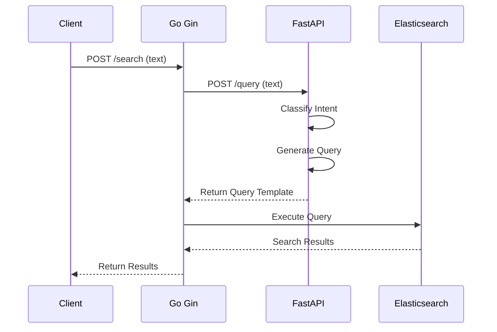

# Search Service Projects

This repository contains multiple services for search functionality.

## System Flow

## System Flow

## Projects

### [Intent Recognition API](/fastapi/intent-recognition-api/README.md)
- Text intent classification service
- Query vectorization
- FastAPI backend service
- [xlm-roberta-large-xnli](https://huggingface.co/joeddav/xlm-roberta-large-xnli) model license MIT

### [Search Recognition API](/recommendation/README.md)
- Search by text
- Gin backend service

## Project Structure
- vector, intent (fastapi)
- search application (go-gin)
- db (elasticsearch, redis)